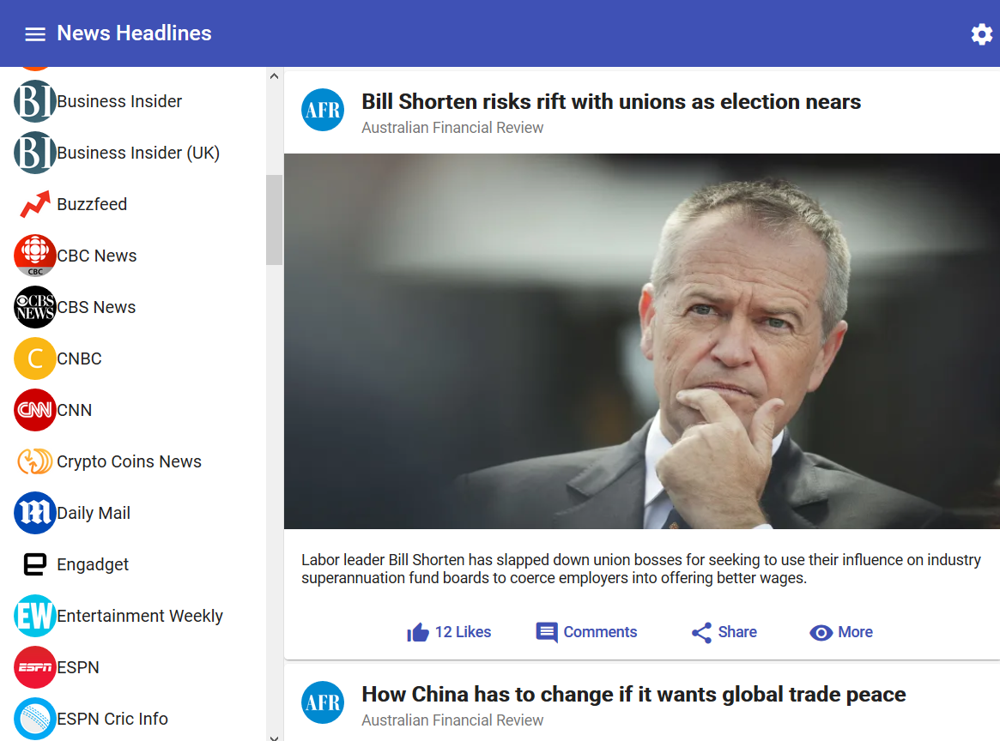

# Add Angular Material 

Angular Material is a collection of high-quality components  which implemented the Google's Material Design language. 

Generate an Angular project via Angular CLI.

```bash
ng new materialapp
```

Enter the workspace, add Angular Material to your Angular project.

```bash
ng add @angualr/material @angular/cdk
```

Unlike `npm install` , `ng add` do more things on your project codes. It will add `@angular/material` and its transitive dependencies into the project, and also try add essential configurations of these packages in an interactive mode, including:

* Add a built-in theme according to your answer, it will append the style path in the `angular.json` file.
* Optionally, it will add  Angular animations support, it imports `BrowserAnimationModule` in `app.component.ts` file.
* Add Material Icons and Google's Robot fonts configuration in the `index.html`.

Related useful links:

* [The usage of ng add](https://angular.io/cli/add)

* [Angular CLI schematics support in Angular Material ](https://material.angular.io/guide/schematics)

* [The Getting Started Guide of Angular Material](https://material.angular.io/guide/getting-started)

Create a module to export  Angular Material modules that will be used  in your project.

```bash
ng g m material --flat 
```

Import the modules and add them to exports declaration in `NgModule` annotation.

```typescript
import { MatToolbarModule } from '@angular/material/toolbar';
//import others

@NgModule({
  exports: [
    MatToolbarModule,
    // other modules
  ]
})
export class MaterialModule {}
```

Import it in the `app.module.ts`.

```typescript
import { MaterialModule } from './material.module';

@NgModule({
  ...
  imports: [
    //...
    MaterialModule
  ],
  ...
})
export class AppModule {}
```


Create a simple layout with sidenav[^1]  and toolbar[^2]. 

```html
<mat-toolbar>
  	// toolbar
</mat-toolbar>
<mat-sidenav-container>
  <mat-sidenav >
      // sidenav
  </mat-sidenav>
  <mat-sidenav-content>
      // content 
  </mat-sidenav-content>
</mat-sidenav-container>
```

The Smashing Magazine provides a great tutorial[^3]  to create a starter of  Angular Material. I added a small modification according to Sidenav documentation.




[^1]: [Sidenav](https://material.angular.io/components/sidenav/overview)
[^2]: [Toolbar](https://material.angular.io/components/toolbar/overview)
[^3]: [How To Build A News Application With Angular 6 And Material Design](https://www.smashingmagazine.com/2018/10/news-application-with-angular-and-material-design/)


